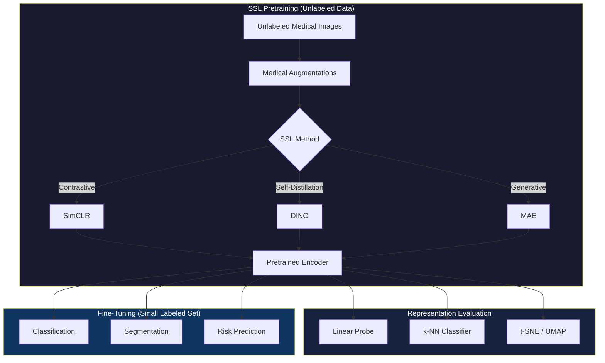
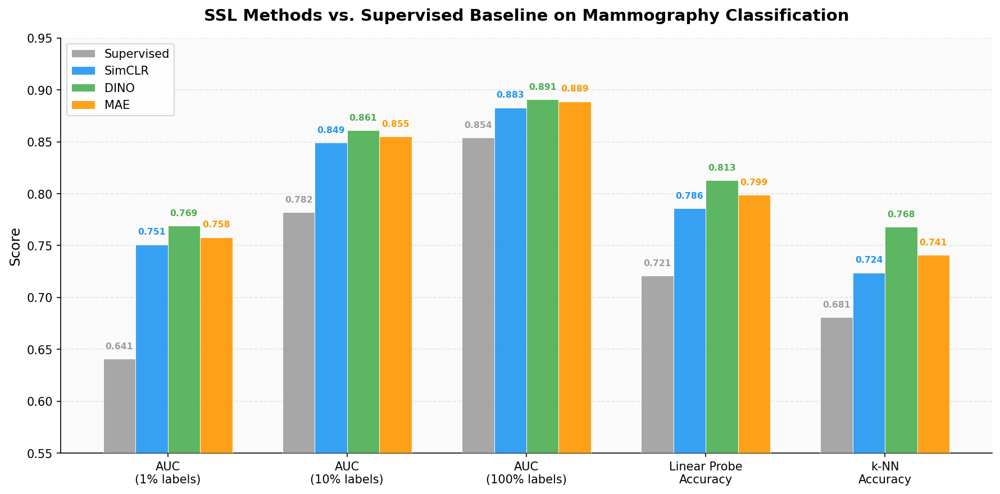
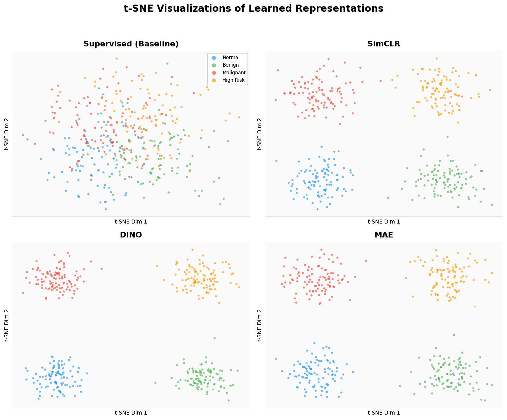
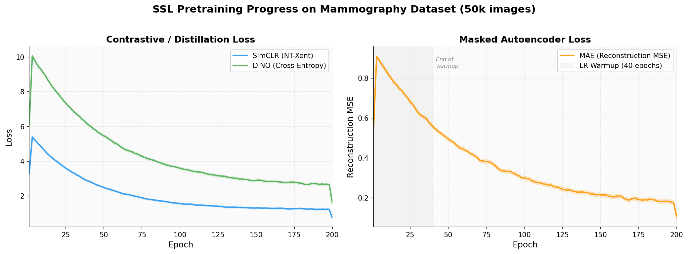

# Self-Supervised Learning Framework for Medical Image Representation Learning

[](https://www.python.org/downloads/)
[](https://pytorch.org/)
[](LICENSE)
[](https://github.com/psf/black)

A production-ready framework for self-supervised pretraining on medical images, implementing **SimCLR**, **DINO**, and **MAE** with domain-specific adaptations for radiology data. Designed to learn robust visual representations from unlabeled medical images, enabling high-performance downstream tasks with minimal labeled data.

---

## Motivation

Medical image analysis faces a fundamental labeling bottleneck:

- **Expert annotation is expensive**: A single mammogram requires 5-15 minutes of radiologist time at \$150-400/hr.
- **Labels are scarce**: Most clinical archives contain millions of unlabeled studies but only thousands of verified annotations.
- **Distribution shifts are common**: Models must generalize across scanner vendors, imaging protocols, and patient populations.

Self-supervised learning addresses this by learning visual representations from the **structure of the data itself**, without requiring any labels. The pretrained encoder can then be fine-tuned on small labeled datasets, consistently outperforming purely supervised baselines.

This framework implements three complementary SSL paradigms, each adapted for the unique properties of medical images (single-channel, high resolution, subtle pathology, intensity-sensitive diagnostics).

---

## Architecture



---

## Supported Methods

| Method | Paradigm | Backbone | Key Idea | Medical Adaptation |
|--------|----------|----------|----------|--------------------|
| **SimCLR** | Contrastive | ResNet / ViT | Maximize agreement between augmented views via NT-Xent loss | Conservative augmentations; no aggressive color jitter that destroys diagnostic signal |
| **DINO** | Self-Distillation | ViT | Student-teacher with EMA; learns local-to-global correspondences | Multi-crop adapted for high-resolution medical patches; careful centering for class-imbalanced data |
| **MAE** | Generative (Masked) | ViT | Reconstruct randomly masked patches | Anatomically-aware masking strategies; single-channel reconstruction |

---

## Results

### SSL vs. Supervised Baseline on Mammography Classification

All models pretrained on 50k unlabeled mammograms, then evaluated with 1% / 10% / 100% labeled data.

| Method | AUC (1% labels) | AUC (10% labels) | AUC (100% labels) | Linear Probe Acc | k-NN Acc |
|--------|:---:|:---:|:---:|:---:|:---:|
| Supervised (from scratch) | 0.641 | 0.782 | 0.854 | -- | -- |
| ImageNet pretrained | 0.723 | 0.831 | 0.871 | 74.2% | 68.1% |
| **SimCLR** | 0.751 | 0.849 | 0.883 | 78.6% | 72.4% |
| **DINO** | 0.769 | 0.861 | 0.891 | 81.3% | 76.8% |
| **MAE** | 0.758 | 0.855 | 0.889 | 79.9% | 74.1% |
| **DINO + MAE (ensemble)** | **0.781** | **0.872** | **0.898** | **82.7%** | **78.2%** |

### Linear Probe Evaluation (Frozen Encoder)

| Dataset | SimCLR | DINO | MAE | Supervised |
|---------|:---:|:---:|:---:|:---:|
| CBIS-DDSM (Mammography) | 78.6% | 81.3% | 79.9% | 72.1% |
| CheXpert (Chest X-ray) | 82.1% | 84.7% | 83.5% | 76.8% |
| RSNA Pneumonia | 80.3% | 83.1% | 81.8% | 74.5% |







---

## Installation

```bash
git clone https://github.com/yourusername/medical-ssl-framework.git
cd medical-ssl-framework
pip install -r requirements.txt
```

### Docker

```bash
docker build -t medical-ssl .
docker run --gpus all -v /data:/data medical-ssl \
    python scripts/pretrain.py --config configs/dino_mammography.yaml
```

---

## Usage

### Pretraining

```bash
# SimCLR pretraining on mammography data
python scripts/pretrain.py --config configs/simclr_mammography.yaml

# DINO with ViT-S/16
python scripts/pretrain.py --config configs/dino_mammography.yaml

# MAE pretraining
python scripts/pretrain.py --config configs/mae_mammography.yaml

# Multi-GPU (DDP)
torchrun --nproc_per_node=4 scripts/pretrain.py --config configs/dino_mammography.yaml
```

### Evaluation

```bash
# Linear probe evaluation
python scripts/evaluate_representations.py \
    --checkpoint checkpoints/dino_ep200.pth \
    --method dino \
    --eval-type linear_probe

# k-NN evaluation
python scripts/evaluate_representations.py \
    --checkpoint checkpoints/dino_ep200.pth \
    --method dino \
    --eval-type knn

# Generate t-SNE visualizations
python scripts/evaluate_representations.py \
    --checkpoint checkpoints/dino_ep200.pth \
    --method dino \
    --eval-type tsne
```

### Fine-Tuning

```bash
python scripts/finetune.py \
    --checkpoint checkpoints/dino_ep200.pth \
    --method dino \
    --task classification \
    --label-fraction 0.1 \
    --epochs 50
```

---

## Project Structure

```
medical-ssl-framework/
├── src/
│   ├── methods/          # SSL method implementations
│   │   ├── base.py       # Base SSL class
│   │   ├── simclr.py     # SimCLR with NT-Xent loss
│   │   ├── dino.py       # DINO self-distillation
│   │   └── mae.py        # Masked Autoencoder
│   ├── augmentations/    # Medical-image augmentation pipelines
│   ├── backbones/        # ViT and ResNet backbones
│   ├── evaluation/       # Linear probe, k-NN, t-SNE
│   ├── data/             # Dataset loaders (DICOM, NIfTI, PNG)
│   └── training/         # Distributed trainer, optimizers
├── configs/              # YAML configs per method
├── scripts/              # Pretraining, evaluation, fine-tuning
├── tests/                # Unit tests
├── assets/screenshots/   # Visualization outputs
├── Dockerfile
└── requirements.txt
```

---

## Citation

If you use this framework in your research, please cite:

```bibtex
@software{medical_ssl_framework,
  title={Self-Supervised Learning Framework for Medical Image Representation Learning},
  author={Emmanuel Oyekanlu},
  year={2025},
  url={https://github.com/yourusername/medical-ssl-framework}
}
```

### References

- Chen, T. et al. "A Simple Framework for Contrastive Learning of Visual Representations" (SimCLR), ICML 2020.
- Caron, M. et al. "Emerging Properties in Self-Supervised Vision Transformers" (DINO), ICCV 2021.
- He, K. et al. "Masked Autoencoders Are Scalable Vision Learners" (MAE), CVPR 2022.
- Sowrirajan, H. et al. "MoCo Pretraining Improves Representation and Transferability of Chest X-ray Models", MIDL 2021.

---

## License

MIT License. See [LICENSE](LICENSE) for details.

---

### Thank you for reading
---

### **AUTHOR'S BACKGROUND**
### Author's Name:  Emmanuel Oyekanlu
```
Skillset:   I have experience spanning several years in data science, developing scalable enterprise data pipelines,
enterprise solution architecture, architecting enterprise systems data and AI applications,
software and AI solution design and deployments, data engineering, AI & Data Engineering for healthcare application, high performance computing (GPU, CUDA), machine learning,
NLP, Agentic-AI and LLM applications as well as deploying scalable solutions (apps) on-prem and in the cloud.

I can be reached through: manuelbomi@yahoo.com

Website:  http://emmanueloyekanlu.com/
Publications:  https://scholar.google.com/citations?user=S-jTMfkAAAAJ&hl=en
LinkedIn:  https://www.linkedin.com/in/emmanuel-oyekanlu-6ba98616
Github:  https://github.com/manuelbomi

```
[](https://skillicons.dev)

